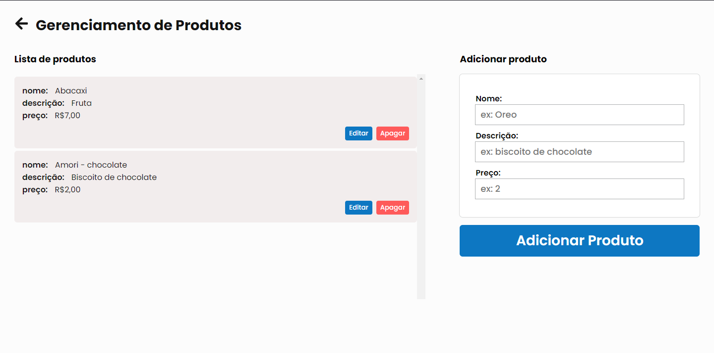
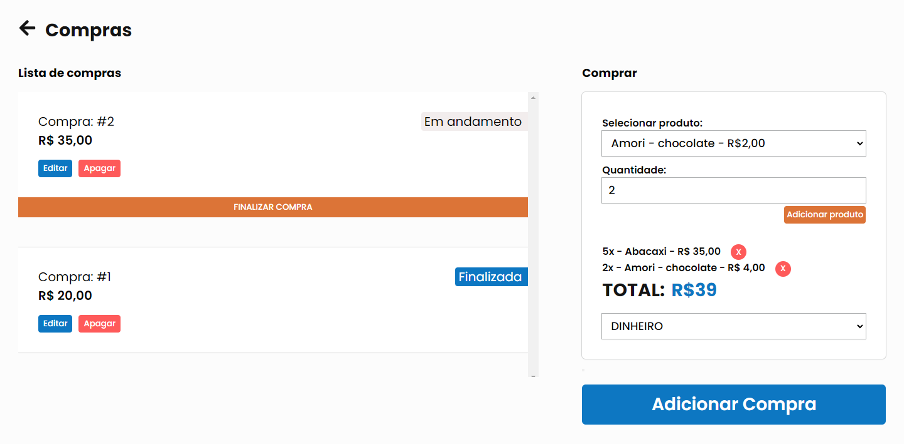
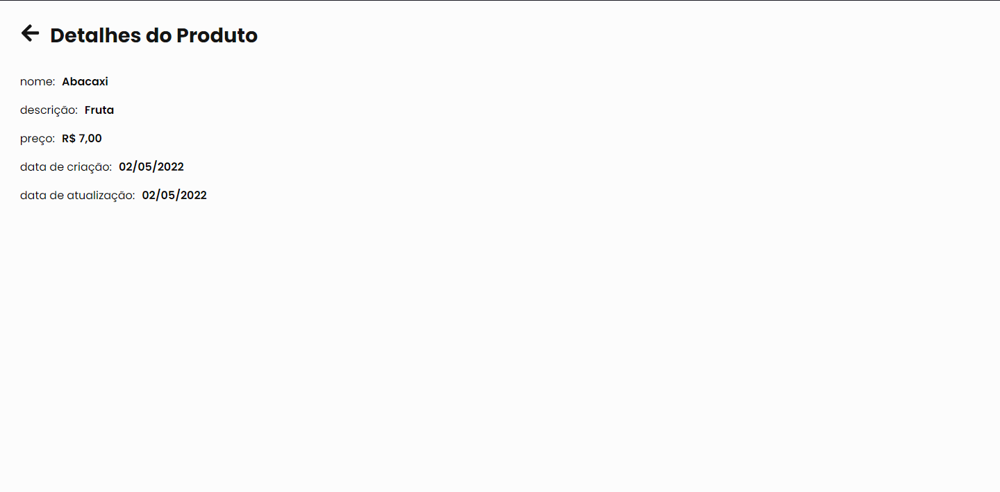
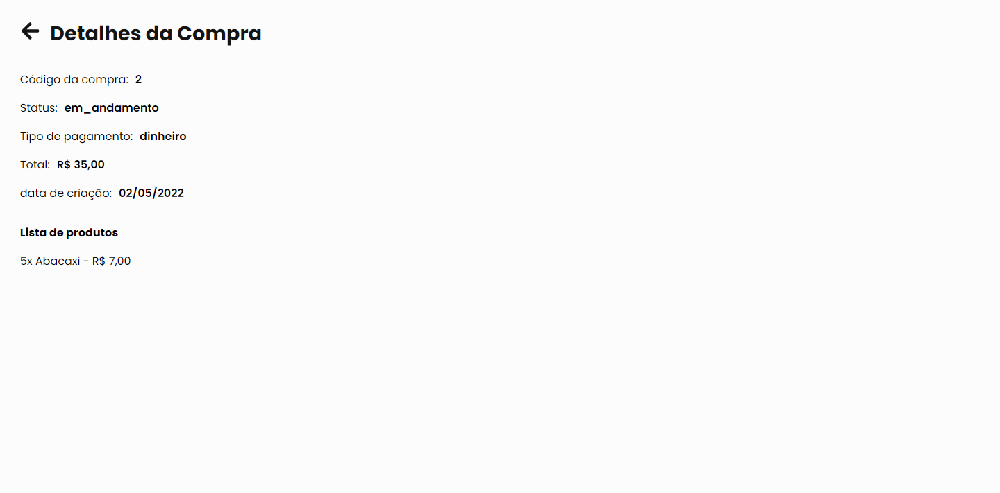
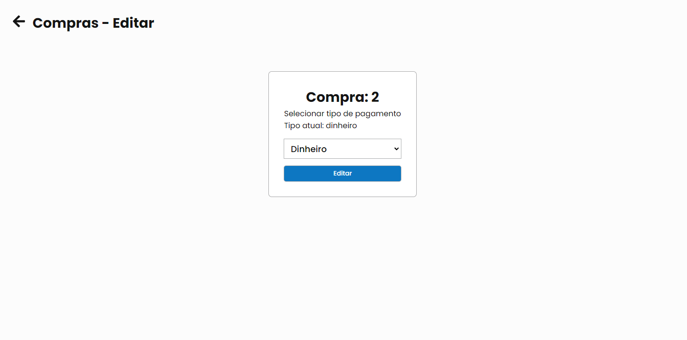

## NodeStore 
  Sistema de compra de produtos desenvolvido em ReactJS e TypeScript

Home 


Cadastro e listagem de produtos


Compra e listagem de compras


Detalhes de produto 


Detalhes de compra 


Edição de produto


Edição de compra

### Requisitos para utilização do sistema
  - Node
  - Backend do sistema (api)
  ``` git clone https://github.com/pabloguedesc/node_store_backend.git ```

### 1. Instalar as depedências.
  ```npm install```
	ou
  ```yarn```

### 2. Rodar script do sistema:
  ````npm start````
	ou
  ```yarn start```